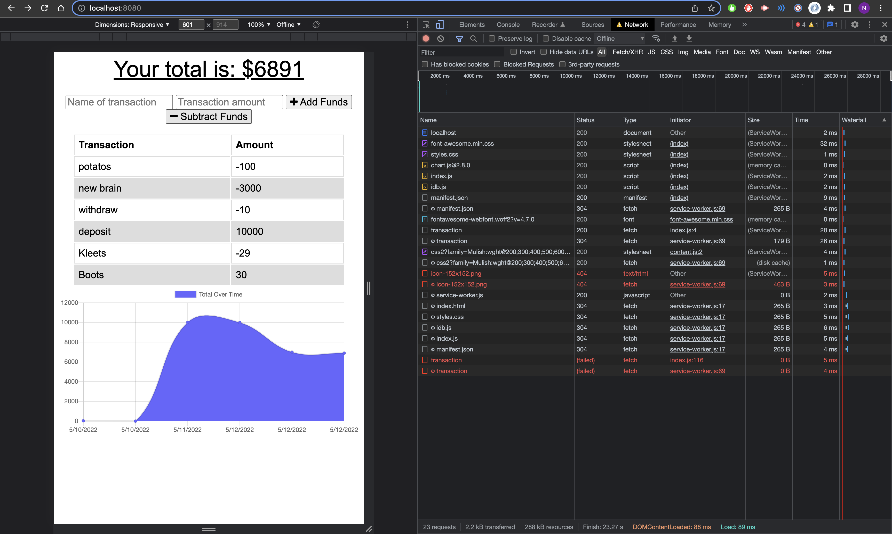
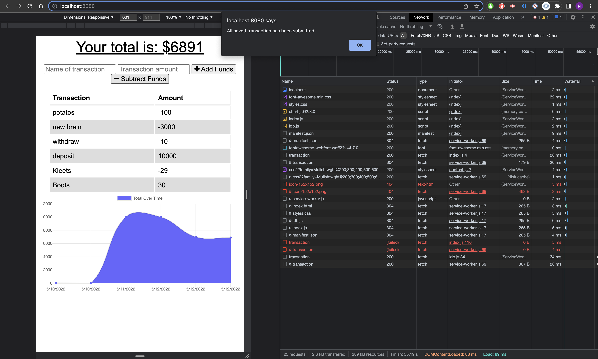

# Man-with-a-plan

## Description

Giving users a fast and easy way to track their money is important, but allowing them to access that information at any time is even more important. Having offline functionality is paramount to the success of an application that handles users’ financial information.

## User Story
AS AN avid traveler
I WANT to be able to track my withdrawals and deposits with or without a data/internet connection
SO THAT my account balance is accurate when I am traveling 

## Acceptence Criteria

- GIVEN a budget tracker without an internet connection
- WHEN the user inputs an expense or deposit
- THEN they will receive a notification that they have added an expense or deposit
- WHEN the user reestablishes an internet connection
- THEN the deposits or expenses added while they were offline are added to their transaction history and their totals are updated

## Screenshots

## Technologies

- Service Worker
- Manifest
- MongoDB
- Heroku
- IndexDB
- Node.js

## Live Application Link

For live application please click [Man With A Plan](https://man-with-a-plan.herokuapp.com/).
